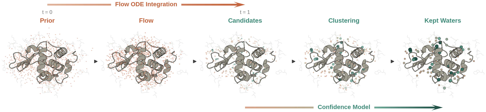
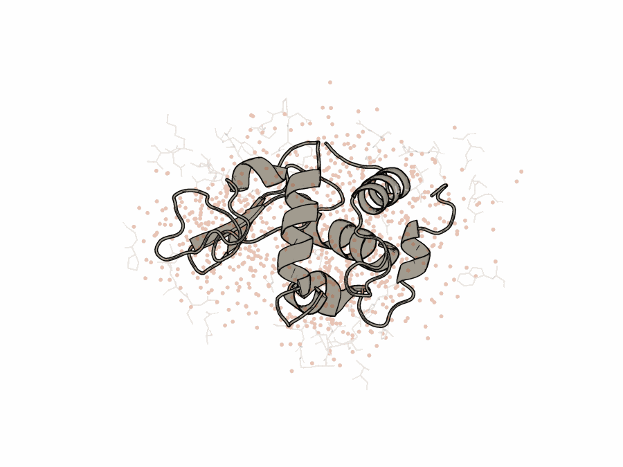

# WaterFlow: Prediction of Ordered Water Molecule Positions on Protein Structures 

<p align="center">
  
</p>

WaterFlow has two trained components: a **flow-matching generator** that proposes candidate waters conditioned on the
protein structure, and a **confidence scorer** that ranks and scores each candidate to obtain final water coordinates.

The documentation is split into two main components:

**Prediction** ([Predicting waters](#predicting-waters)) runs inference with the trained
models on a structure: the flow-matching generator samples candidate waters, the
confidence model scores them, and the scored candidates are clustered and thresholded to
the final set written back into the input structure.

**Training** ([Training your own models](#training-your-own-models)) reproduces the
two models in four steps: precomputing embeddings, training the flow generator,
caching candidate waters sampled from it, then training the confidence model on those
candidates.

## Table of Contents

- [Installation](#installation)
- [Predicting waters](#predicting-waters)
  - [Selecting the final waters](#selecting-the-final-waters)
  - [Options](#options)
- [Training your own models](#training-your-own-models)
- [Documentation](#documentation)

## Installation

WaterFlow uses [`uv`](https://docs.astral.sh/uv/) with Python 3.12.

```bash
uv sync
```

Every command runs through `uv run`. The pretrained checkpoints in `checkpoints/`
are stored with [Git LFS](https://git-lfs.com); run `git lfs install && git lfs pull`
after cloning to fetch the weights (see [Predicting waters](#predicting-waters)).

<details>
<summary>Building a virtual environment from scratch</summary>

```bash
uv venv water --python 3.12
source water/bin/activate

uv pip install torch==2.8.0
uv pip install torch_geometric
uv pip install torch_cluster torch_scatter pyg_lib -f https://data.pyg.org/whl/torch-2.8.0+cu126.html
uv pip install esm biotite pymol-open-source scipy pandas numpy matplotlib pillow loguru tqdm wandb e3nn
uv pip install pytest pytest-cov   # dev
```

If `torch_cluster` or `torch_scatter` fail to install, match the CUDA version in
the wheel URL to your toolkit.

</details>

## Predicting waters

`scripts/predict_waters.py` is the end-to-end prediction tool. Given a raw PDB or mmCIF structure it
strips any existing waters, builds the required dataset graph from protein + het-atoms, samples
candidates with the flow model, scores them with the confidence model, selects the
final set, and writes out the input structure with the predicted waters added.

### Before you run

**Trained models.** This repo contains two types of pretrained models sets under
`checkpoints/`, varying in whether they were trained with symmetry mates or not as added
context nodes. The weights are stored in [Git LFS](https://git-lfs.com):

| `--ckpt_dir` | Symmetry mates | Contents |
|---|---|---|
| `checkpoints/mates` (default) | yes | `flow.pt`, `confidence.pt`, `flow_config.json`, `confidence_config.json` |
| `checkpoints/mates_off` | no | same four files |

`predict_waters.py` defaults to `checkpoints/mates`. Pass `--ckpt_dir
checkpoints/mates_off` to run without mates, or point it at your own directory of
the same four files — see [Training your own models](#training-your-own-models).

Fetch the weights before predicting. Install Git LFS:

```bash
# Option A — conda / mamba:
conda install -c conda-forge git-lfs

# Option B — user-local binary, from https://github.com/git-lfs/git-lfs/releases:
VERSION=3.5.1   # set to the latest release
curl -L https://github.com/git-lfs/git-lfs/releases/download/v${VERSION}/git-lfs-linux-amd64-v${VERSION}.tar.gz \
  | tar -xz -C /tmp
mkdir -p ~/.local/bin && cp /tmp/git-lfs-${VERSION}/git-lfs ~/.local/bin/   # ensure ~/.local/bin is on PATH

# Option C — system package manager (needs root):
sudo apt-get install git-lfs   # Debian/Ubuntu (macOS: brew install git-lfs)
```

Then fetch the weights:

```bash
git lfs install    # once per machine
git lfs pull       # download the checkpoint weights
```

Without Git LFS, `git clone` / `git pull` still succeed, but each `.pt` arrives as a
small text pointer (a few hundred bytes) instead of the ~42 MB model, and loading it
fails. Installing Git LFS and running `git lfs pull` replaces the pointers with the
real files.

**Data processing.** Prediction does not use the training data pipeline. For each
input structure it builds an *inference graph* directly from the raw PDB/CIF:

- **Waters are removed.** They are what the model predicts, so any existing waters in the file
  are dropped and the graph starts with no water nodes.
- Protein and hets (ligands, ions, cofactors, nucleic acids) are kept, coordinates
  are centered on the ASU protein centroid, and symmetry mates are added when the
  flow run used them. 

**Embeddings.** If the flow model uses the ESM encoder (the default), precompute
embeddings for your inputs first — the same step as for training
([Precompute embeddings](#1-precompute-embeddings)) into `<processed_dir>/esm/`,
and pass `--processed_dir <cache_root>`. Each embedding is keyed by the input's file
stem (`protein.cif` -> `esm/protein.pt`), so the names must match. The `gvp` encoder
needs no embeddings and no `--processed_dir`. **The shipped checkpoints require ESM embeddings.** 

Predict with the default (mates) checkpoints:

```bash
uv run python -m scripts.predict_waters \
    --struc protein.cif \
    --processed_dir <cache_root> \
    --out_dir out/ \
    --selection density \
    --density_ratio 0.6
```

Use the no-mates models instead:

```bash
uv run python -m scripts.predict_waters \
    --struc protein.cif \
    --processed_dir <cache_root> \
    --out_dir out/ \
    --ckpt_dir checkpoints/mates_off
```

Run a batch by pointing at a list instead of a single file. Each entry is a path
under `--base_pdb_dir`, with or without a `.pdb`/`.cif` extension:

```bash
uv run python -m scripts.predict_waters \
    --pdb_list structures.txt --base_pdb_dir <pdb_dir> \
    --processed_dir <cache_root> \
    --out_dir out/
```

Pass `--geometry_cache <dir>` to cache the flow inputs (inference graphs) at
`<dir>/<name>.pt` and the flow outputs (sampled candidates) at
`<dir>/candidates/<name>.pt`. Both are reused when present, so a re-run skips graph
construction and flow sampling for structures already cached.

**Outputs**, per structure, in the input coordinate frame:

- `<name>_pred.pdb` (or `.cif` with `--out_format .cif`) — the input protein and
  hets with predicted waters added as `HOH` oxygens.
- `<name>_waters.txt` — one `x y z confidence` row per predicted water.

### Selecting the final waters

This is the main knob. Both modes sample `--water_ratio * num_residues` candidates,
score each, and cluster overlapping candidates into van der Waals centroids (each
centroid keeps its cluster's highest confidence). They differ in how the final set
is chosen:

| `--selection` | Rule | Use when |
|---|---|---|
| `confidence` (default) | Drop candidates below `--confidence_threshold` (default `0.5`), then keep every centroid. | You want a calibrated score cutoff; the water count follows from the data. |
| `density` | Cluster with no cutoff, then keep the top `floor(--density_ratio * ASU_residues)` centroids by confidence (default ratio `0.6`). | You want a target hydration level tied to protein size, not an absolute score. |

Each mode accepts only its own knob: `--confidence_threshold` is rejected under
`density`, and `--density_ratio` is rejected under `confidence`.

### Options

| Argument | Default | Description |
|---|---|---|
| `--ckpt_dir` | `checkpoints/mates` | Directory with `flow.pt`, `confidence.pt`, `flow_config.json`, `confidence_config.json`; use `checkpoints/mates_off` for no mates |
| `--struc` / `--pdb_list` | one required | A single structure file, or a list of names under `--base_pdb_dir` |
| `--out_dir` | required | Output directory |
| `--out_format` | `.pdb` | Written structure format: `.pdb` or `.cif` |
| `--selection` | `confidence` | `confidence` or `density` (see above) |
| `--confidence_threshold` | `0.5` | `confidence` mode: drop candidates scoring below this |
| `--density_ratio` | `0.6` | `density` mode: keep `floor(ratio × ASU residues)` waters |
| `--water_ratio` | `8.0` | Candidates sampled = ratio × num_residues |
| `--num_steps` | `20` | Flow integration steps |
| `--method` | `euler` | Integration method: `euler` or `rk4` |
| `--include_mates` | model's setting | Add symmetry mates to the graph |
| `--processed_dir` | none | Embedding cache root for `esm`/`slae` (unused for `gvp`) |
| `--geometry_cache` | none | Cache flow inputs at `<dir>/<name>.pt` and candidates at `<dir>/candidates/<name>.pt`; reused on re-runs |
| `--batch_size` | `4` | Structures per batch |
| `--device` | `cuda` | Compute device |

## Training your own models

Producing the flow and confidence checkpoints is a four-step pipeline. Training
reads structures from a `--base_pdb_dir` laid out as
`<base_pdb_dir>/<pdb_id>/<pdb_id>_final.{cif,pdb}`, with split files listing one
bare ID per line (`6eey_final`). See [docs/data.md](docs/data.md) for the directory
layout, cache structure, and quality filters.

### 1. Precompute embeddings

The default encoder is **ESM** (ESM3). Generate its per-residue embeddings once,
before training or inference:

```bash
uv run python -m scripts.generate_esm_embeddings \
    --split_file splits/water_pdbs.txt \
    --base_pdb_dir <pdb_dir> \
    --cache_dir <cache_root>
```

Embeddings are written to `<cache_root>/esm/`. The `gvp` encoder learns from
coordinates directly and needs no precomputation.

> **SLAE is legacy.** The `slae` encoder is kept for older runs. It depends on the
> external `SLAE` package (not a WaterFlow dependency) and an autoencoder
> checkpoint — see `scripts/generate_slae_embeddings.py`. New runs use ESM.

### 2. Train the flow generator

The geometry cache is built automatically from `--base_pdb_dir` on the first run
and reused afterward.

```bash
uv run python -m scripts.train \
    --train_list splits/train_list_0.95.txt \
    --val_list splits/valid_list_0.05.txt \
    --base_pdb_dir <pdb_dir> \
    --processed_dir <cache_root> \
    --encoder_type esm \
    --batch_size 1 \
    --grad_accum_steps 4
```

Checkpoints, `config.json`, and logs land in `<save_dir>/<run_name>/`. That run
directory is the `--flow_run_dir` for later stages.

**Multi-GPU:** launch the same command with `torchrun` — no code flag needed. Plain
`python -m scripts.train` stays single-GPU.

```bash
uv run torchrun --nproc_per_node=4 -m scripts.train \
    --train_list splits/train_list_0.95.txt \
    --val_list splits/valid_list_0.05.txt \
    --base_pdb_dir <pdb_dir> \
    --processed_dir <cache_root> \
    --encoder_type gvp \
    --batch_size 4        # per rank -> effective 16
```

Full argument reference, DDP mechanics, and W&B logging: [docs/training.md](docs/training.md).

### 3. Cache candidate waters

The confidence model trains on waters sampled from a trained flow checkpoint.
Generate that candidate cache once:

```bash
uv run python -m scripts.cache_candidates \
    --flow_run_dir <flow_run> \
    --pdb_list splits/conf_pdbs.txt \
    --base_pdb_dir <pdb_dir> \
    --processed_dir <cache_root>
```

Candidates are written to `<cache_root>/candidate_cache/<run>_<ckpt>_<method><steps>_r<ratio>_s<seed>/`,
one `<pdb_id>.pt` per structure. That directory is the `--candidate_dir` for the
next step.

### 4. Train the confidence scorer

```bash
uv run python -m scripts.train_confidence \
    --flow_run_dir <flow_run> \
    --train_list splits/conf_train.txt \
    --val_list splits/conf_valid.txt \
    --candidate_dir <candidate_dir> \
    --base_pdb_dir <pdb_dir> \
    --processed_dir <cache_root> \
    --save_dir <out> \
    --run_name <run_name> \
    --init_from <flow_run>/checkpoints/best.pt \
    --freeze_backbone
```

`--init_from` warm-starts the shared backbone from the flow checkpoint;
`--freeze_backbone` then trains only the score head. Validation reports AUC-PR
(used for checkpoint selection) and best F1. Multi-GPU works the same way as flow
training — prefix with `torchrun --nproc_per_node=N`.

### Evaluating the flow generator alone

`inference.py` scores the flow generator against ground-truth waters, separately
from the confidence model. It reads cached training-format graphs (not raw files)
and reports precision, recall, and RMSD.

```bash
uv run python -m scripts.inference \
    --run_dir <flow_run> \
    --pdb_list splits/test_list.txt \
    --base_pdb_dir <pdb_dir> \
    --processed_dir <cache_root> \
    --output_dir ./eval \
    --method rk4 \
    --num_steps 100
```

`--threshold` (default `1.0` Å) sets the distance for precision/recall matching.
Use `--water_ratio` to sample a fixed count instead of the ground-truth number;
metrics that need ground truth are skipped automatically when it is set.

## Documentation

- [docs/data.md](docs/data.md) — input layout, split files, EDIA, the geometry /
  ESM / SLAE cache structure, and quality filters.
- [docs/model.md](docs/model.md) — the two-stage architecture, encoder types, and
  edge construction.
- [docs/training.md](docs/training.md) — full argument reference for the flow and
  confidence trainers, DDP, checkpoints, and W&B.

<p align="center">
  
</p>
